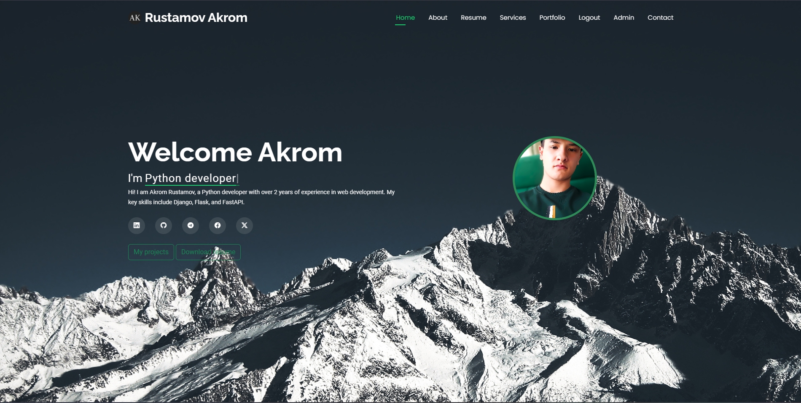

# My Portfolio 2

Welcome to my portfolio! This project showcases my work as a Python developer with a focus on web applications. It features various projects I've completed, highlighting my skills and technologies used.

## Table of Contents

- [Features](#features)
- [Technologies Used](#technologies-used)
- [Installation](#installation)
- [Usage](#usage)
- [Project Structure](#project-structure)
- [License](#license)
- [Contact](#contact)

## Features

- **User Authentication**: Secure login and registration for users.
- **Dynamic Project Showcase**: Easily add or remove projects from the portfolio.
- **File Upload**: Upload and manage project images and documents.
- **Admin Panel**: Manage content through an intuitive admin interface.

## Technologies Used

- **Backend**: Python, Flask
- **Database**: SQLite
- **Front-End**: HTML, CSS, Bootstrap
- **Email**: SMTP (Gmail)
- **Task Queue**: Celery (with Redis/RabbitMQ)
- **Admin Panel**: Flask-Admin


## Docker un
```
docker compose up --build
```